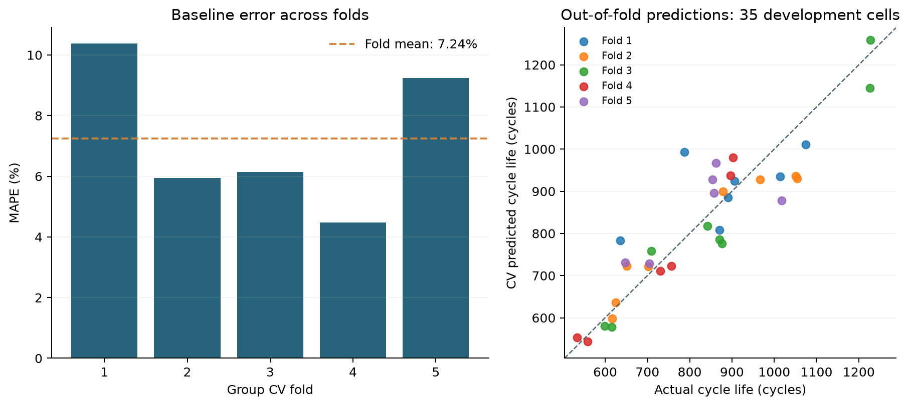

# ESS 배터리 수명 예측

배터리 **첫 100사이클의 정보로 최종 Cycle Life를 예측**하는 개인 수업 프로젝트다. Batch 1·2·3의 EDA를 모델 설계와 연결하고, Batch 1에서 개발한 회귀 모델의 배치 간 일반화를 Batch 2에서 평가한다. 딥러닝은 사용하지 않는다.

> 현재 개발 버전은 **0.1.0**, 실행한 모델 실험은 **v01_baseline**이다. Day 1 EDA와 첫 기준 모델의 개발 CV를 완료했다. 최종 모델 선택·Hold-out·Batch 2 평가는 아직 진행 전이다. 문서 갱신: 2026-10-05 (Asia/Seoul).

## 프로젝트 개요

| 항목 | 내용 |
| --- | --- |
| 데이터 | [Kaggle MIT-Stanford Battery Dataset](https://www.kaggle.com/datasets/itshpark/data-driven-prediction-of-battery-cycle), Severson et al. (2019) 관련 데이터 |
| 학습·개발 | Batch 1, 2017-05-12, 46셀 |
| 필수 최종 평가 | Batch 2, 2018-02-20, 47셀 중 유효 수명 39셀 |
| 선택 추가 평가 | Batch 3, 2018-04-12, 46셀 중 유효 수명 44셀 |
| 태스크·단위 | Regression, 배터리 셀 1개당 한 행 |
| 입력·타깃 | 초기 100사이클 이내 피처 → 원본 최종 `cycle_life`(사이클) |
| 제출자 | 울산 3반 이웅희, 개인 과제 |
| Day 2 제출 | **Public GitHub 저장소 링크**, 마감 DAY 2 16시 |

원본 139셀을 보존했다. 수명 결측 10셀은 원본에 남기고, 수명 통계에서는 유효 타깃 분모를 명시한다. 논문의 셀 제외·병합·분할 규칙을 과제에 자동 적용하지 않는다.

## 개발 버전과 재현성

| 구분 | 버전·기록 | 상태 |
| --- | --- | --- |
| 프로젝트 | `0.1.0` — [pyproject.toml](pyproject.toml) | 프로젝트 메타데이터 버전; GitHub 릴리스 발행을 뜻하지 않음 |
| 첫 모델 실험 | `v01_baseline` — [실행 설정·기록](configs/experiments/v01_baseline.json) | 2026-10-02 실행, 개발 CV 완료 |
| 후속 실험 | `v02_feature_change`, `v03_model_change` | 준비한 디렉터리만 존재; 피처·모델 변경 실험 미실행 |
| 의존성 | [uv.lock](uv.lock), [환경 기록](configs/environment.json) | 정확한 직접·간접 패키지 버전 보존 |
| 데이터 | [data-snapshot.json](configs/data-snapshot.json) | 원본 경로·크기·수정 시각·SHA-256 |
| 분할 | [분할 manifest](artifacts/splits/batch1_group_holdout_cv.json) | 충전 조건 그룹과 셀의 Hold-out·CV 배정 보존 |
| 코드·실행 | [v01 run-manifest](artifacts/experiments/v01_baseline/run-manifest.json) | 코드·입력·산출물 해시, 환경, 실행 시각 연결 |

프로젝트 버전, 실험 버전, 패키지 버전은 서로 다른 기록이다. `v01` 모델 소스 SHA-256은 `f3c9417da0aed4e1d745a85d067f91dbfd352e3eb155535380590b17c0729438`이다. 새 실험은 기존 결과와 구분되는 설정·분할·지표·예측 기록을 남긴다. 코드 버전은 Git으로 추적하며 공개 저장소는 [LWH4Data/battery-project](https://github.com/LWH4Data/battery-project)다. 프로젝트 메타데이터 버전과 Git 커밋을 함께 확인한다.

### 기술 스택

아래는 **2026-10-02 기록된 실행 환경**이다. Python 3.12 계열, macOS Apple Silicon에서 확인했다.

| 기술 | 버전 | 용도 |
| --- | --- | --- |
| Python / uv | 3.12.13 / 0.12.19 | 실행 환경·의존성 관리 |
| NumPy / pandas | 2.5.3 / 3.0.6 | 수치 계산·표 처리 |
| SciPy | 1.18.1 | 통계 분석·가설검정 |
| Matplotlib | 3.11.2 | EDA·오차 시각화 |
| h5py / mat73 | 3.16.0 / 0.65 | HDF5·MATLAB 원본 읽기 |
| ipykernel | 7.4.0 | 프로젝트 노트북 커널 |
| scikit-learn | 1.9.1 | 회귀·그룹 분할·Pipeline·성능 지표 |
| joblib | 1.6.0 | 학습 Pipeline 저장 |

정확한 환경은 `uv.lock`을 기준으로 재현한다. `pyproject.toml`의 `>=`는 허용 범위다. Optuna는 설치·실행하지 않았다.

## 파일 구조

```text
battery-project/
├── README.md                         # 개발 안내와 Day 2 보고
├── AGENTS.md                         # 작업 범위·설계 확인 규칙
├── pyproject.toml / uv.lock           # 프로젝트 버전·잠금 의존성
├── .python-version / .gitignore
├── configs/
│   ├── environment.json / data-snapshot.json
│   └── experiments/v01_baseline.json
├── data/
│   ├── README.md                     # 원본 확보·배치별 경로
│   ├── raw/{batch1,batch2,batch3}/     # 원본 MAT, Git 추적 제외
│   ├── interim/{batch1,batch2,batch3}/ # 필요 시 중간 데이터
│   └── processed/                    # 최종 모델 입력용, 현재 준비 단계
├── notebooks/
│   ├── 00_data_check.ipynb            # 원본·요약·10/100번 곡선 확인
│   ├── 01_day1_eda.ipynb              # 5개 EDA·가설검정·모델 전략
│   └── 02_day2_modeling.ipynb          # 그룹 분할·v01 CV
├── src/
│   ├── data.py                       # 원본 로더·표 준비
│   ├── eda_distribution_protocol.py  # 분포·프로토콜·전류
│   ├── eda_degradation.py             # 열화·탐색적 Knee
│   ├── eda_early_signals.py           # ΔQ·검정·피처 상관
│   ├── eda_tree_constraints.py        # EDA 단계의 트리 외삽 진단
│   ├── eda_report_figures.py          # 보고서용 그림
│   └── modeling_baseline.py           # 확정 분할·v01 실행
├── artifacts/
│   ├── splits/                       # 셀·프로토콜 분할
│   └── experiments/{v01_baseline,v02_feature_change,v03_model_change}/
├── outputs/
│   ├── project-output-guidelines.md  # 과제 기준·확정 사항
│   ├── day1/                         # EDA 결과·피처 후보·그림·PDF
│   └── day2/                         # 기준 모델 요약·CV 그림·검토
└── work/                             # 임시 작업, Git 추적 제외
```

디렉터리의 존재는 해당 실험의 완료를 뜻하지 않는다. `interim`은 원본을 반복해서 읽는 비용을 줄일 때 쓰는 중간 저장소이며 필수 단계가 아니다. 현재 EDA 피처 후보는 `outputs/day1/early_feature_candidates.csv`에 있다.

## 환경 설정과 실행

프로젝트 루트에서 실행한다. 원본 확보 방법은 [data/README.md](data/README.md)를 따른다.

```bash
cd battery-project
uv sync --locked
uv run python --version
```

VS Code 등 노트북 편집기에서 프로젝트의 `.venv/bin/python`을 커널로 선택한다. JupyterLab은 현재 환경에 별도로 설치하지 않았다.

| 순서 | 노트북 | 내용 |
| --- | --- | --- |
| 1 | [00_data_check.ipynb](notebooks/00_data_check.ipynb) | 배치별 원본 구조·기술통계·요약/곡선 확인 |
| 2 | [01_day1_eda.ipynb](notebooks/01_day1_eda.ipynb) | EDA와 초기 피처 후보 생성 |
| 3 | [02_day2_modeling.ipynb](notebooks/02_day2_modeling.ipynb) | 저장된 그룹 분할로 v01 CV 재현 |

노트북은 위에서 아래로 실행한다. Day 1 재실행은 `outputs/day1`의 분석 결과·그림·피처 CSV·실행기록을 다시 저장한다. 모델링 모듈에는 별도 CLI가 없으므로 기준 모델만 재실행하려면 다음처럼 호출한다.

```bash
uv run python -c 'from pathlib import Path; from src.modeling_baseline import run; run(Path.cwd())'
```

이 명령은 기존 분할의 입력 해시·셀·그룹을 확인해 재사용하며 **v01 결과와 실행기록을 다시 저장**한다. Hold-out·Batch 2·3 예측은 수행하지 않는다. 실험 JSON은 현재 모듈이 저장하는 실행기록이고, 수정해도 모듈의 설정을 바꾸는 입력 파일로 사용되지는 않는다. 분할·누수 검사 일부가 `assert`로 작성되어 있으므로 이를 생략하는 `python -O` 옵션은 사용하지 않는다.

현재 다른 PC에서의 전체 재실행은 검증하지 않았다. Day 1 노트북은 원본 크기와 수정 시각을 검사하므로 복사한 파일의 수정 시각이 다르면 중단될 수 있다. 원본 SHA-256은 snapshot에 기록되어 있다. 입력 CSV가 바뀌면 기존 분할 해시 검사도 중단된다. 검증 기준을 임의로 건너뛰지 않고 데이터 변경 여부를 먼저 확인한다.

## EDA — 관찰에서 모델 전략으로

상세 실행 결과는 [Day 1 노트북](notebooks/01_day1_eda.ipynb)과 [분석 원고](outputs/day1/day1-report.md)에 있다. Batch 2·3도 과제 EDA에서 확인했으며 완전히 미관찰한 배치라고 주장하지 않는다. 모델 선택·튜닝에는 Batch 1 개발 CV만 사용한다.

### 1. Cycle Life 분포

Batch 1/2/3의 수명 중앙값은 **858.5 / 472.0 / 1,005.5사이클**이다. Batch 2는 단수명(<500) **28/39셀**, Batch 3는 장수명(>1,000) **23/44셀**이다. Batch 1에는 단수명 셀이 없어 짧은 수명으로의 일반화가 과제의 핵심이다. 단수명이라는 이유만으로 셀을 제거하지 않는다. [분포 그래프](outputs/day1/figures/q1_life_distribution.png)

### 2. 열화 곡선과 Knee

후기 Qd 기울기가 초기보다 더 음수인 셀은 Batch 1 **46/46**, Batch 2 **45/47**, Batch 3 **46/46**이다. 변화점 탐색의 Knee 위치 중앙값은 약 **600 / 351 / 831사이클**이지만 물리적 Knee를 확정한 결과는 아니다. 전체 곡선·말기 기울기·Knee는 EDA에만 쓰며 초기 수명 예측 피처에 넣지 않는다. [열화 그래프](outputs/day1/figures/q2_report_degradation.png)

### 3. ΔQ(V)와 가설검정

`ΔQ(V) = Qdlin(100, V) - Qdlin(10, V)`. 139셀 모두 필요한 곡선과 동일한 1,000점 전압 축을 확인해 보간 없이 계산했다. Batch 2 장수명 3셀·단수명 28셀의 log10 분산 평균 차이는 **−0.9315**, 양측 Welch **p=0.001378**, 정확 순열 보완 **p=0.0004449**였다. 초기 변화 신호의 근거지만 소표본·프로토콜 교란이 있는 탐색 결과이며 인과관계나 독립 확증을 뜻하지 않는다. [ΔQ 그래프](outputs/day1/figures/q3_delta_q_curves.png) · [검정 그래프](outputs/day1/figures/q3_test_result.png)

### 4. 충전 조건과 수명

첫 단계 C-rate와 수명의 Spearman 상관은 Batch 1 **−0.483**, Batch 2 **+0.055**, Batch 3 **−0.229**로 일정하지 않았다. C1 하나로 수명을 설명하기보다 전환 SOC·C2·실험 조건을 함께 검토한다. 원문 프로토콜은 현재 입력 피처가 아닌 **분할 그룹**으로 사용한다. [C-rate 그래프](outputs/day1/figures/q4_c1_life_relationship.png)

### 5. 초기 신호와 다중공선성

ΔQ log분산과 수명의 Pearson 상관은 Batch 1 **−0.886**, Batch 2 **−0.902**, Batch 3 **−0.702**였다. ΔQ 최소·평균의 Batch 1 상관은 **0.9925**, `Qd100 = Qd10 + ΔQd`처럼 정의가 정확히 중복된 조합도 있다. 대표 신호로 기준선을 만들고, 확장 피처에서는 중복 제거와 규제 회귀를 비교한다. [수명 상관](outputs/day1/figures/q5_report_correlations.png) · [피처 중복](outputs/day1/figures/q5_report_redundancy.png)

## Modeling — Day 2 개발 내용

### 피처 엔지니어링

현재 입력은 **`delta_q_log10var` 한 개**다. 공통 전압 축에서 ΔQ의 모집단 분산(`ddof=0`, Ah² 수치)을 계산한 뒤 log10을 취한다. 임의 epsilon을 더하지 않는다. 타깃은 원본 `cycle_life`이며 로그 변환·보정·예측값 clipping을 적용하지 않았다.

Batch 1의 강한 연관성과 피처 중복을 근거로 단일 신호를 먼저 검증한다. 초기 Qd 변화, 프로토콜 요소, IR·온도·충전시간은 **추가 후보**이며 현재 모델에 사용하지 않았다. 센서 이상·0값·결측 처리와 확장 피처는 아직 확정하지 않았다.

### 분할과 전처리

| 구분 | 셀 / 충전 조건 그룹 | 사용 |
| --- | --- | --- |
| Batch 1 전체 | 46 / 23 | 과제 학습 배치 |
| 개발 부분 | 35 / 18 | 그룹 5-fold CV와 개발 모델 학습 |
| Hold-out | 11 / 5 | 모델 선택 후 별도 검증, 현재 미평가 |

`policy_readable`로 동일 충전 조건의 셀을 묶는다. 그룹의 20%를 `GroupShuffleSplit`으로 보관하고, 개발 부분은 `GroupKFold(5, shuffle=True)`로 나눈다. 분할 seed는 **42**다. 20%는 그룹 수 기준이어서 실제 Hold-out 셀 비율은 11/46이다.

`StandardScaler → LinearRegression` Pipeline을 각 fold의 train에서만 fit한다. 같은 셀·충전 조건 그룹이 train/validation에 겹치지 않는지 검사했고, 개발 35셀은 각각 한 번의 OOF 검증 예측을 가진다. 표준화는 단위를 맞추며 배치 간 수명 분포 차이를 해소하지 않는다.

### 모델 선택과 최적화 방법

| 후보 | EDA에 따른 선택 이유 | 진행 상태 |
| --- | --- | --- |
| LinearRegression | ΔQ log분산의 신호를 단순하고 해석 가능한 선형식으로 확인 | v01 기준 모델 실행 |
| Ridge | 작은 표본에서 확장 피처의 공선성·계수 변동을 L2 규제로 완화할 후보 | 미실행 |
| Elastic Net | 상관된 확장 피처에 L1·L2 규제를 함께 적용하는 비교 후보 | 미실행 |

규제의 역할은 [Ridge](https://scikit-learn.org/stable/modules/generated/sklearn.linear_model.Ridge.html)와 [Elastic Net 공식 문서](https://scikit-learn.org/stable/modules/generated/sklearn.linear_model.ElasticNet.html)에 따른다. 현재는 입력이 하나여서 다중공선성 해소가 v01의 학습 목적은 아니다. **최종 모델은 아직 선정하지 않았다.**

실제로 사용한 학습 방법은 **OLS(최소제곱법)**다. 예측식 `y_hat = b0 + b1 × x`의 잔차 제곱합을 최소화해 계수를 구한다. 단순 기준선을 만들고 관계를 해석하기에 적합하다. OLS는 MAPE를 직접 최소화해 학습하는 방법은 아니다. [LinearRegression 공식 문서](https://scikit-learn.org/stable/modules/generated/sklearn.linear_model.LinearRegression.html)

하이퍼파라미터 최적화는 **아직 수행하지 않았다**. 소수의 규제 설정을 비교할 때 결과를 추적하기 쉬운 Grid Search를 제안했다. 이는 지정한 후보 조합의 비교이며 연속 공간의 전역 최적값을 보장하지 않는다. Grid Search·Optuna의 최종 사용 여부, 탐색 범위·예산·최종 재학습 범위는 사용자 확인 전이다. [GridSearchCV 공식 문서](https://scikit-learn.org/stable/modules/generated/sklearn.model_selection.GridSearchCV.html)

### 평가 지표와 선택 이유

| 지표 | 정의 | 선택 이유·한계 |
| --- | --- | --- |
| **MAPE (%)** | `100 × mean(abs(y_hat − y) / y)` | 과제 주 지표·논문 비교 기준. 같은 절대 오차를 단수명 셀에서 더 크게 평가하며 0·근접 타깃에서는 불안정 |
| MAE (사이클) | `mean(abs(y_hat − y))` | 실제 수명 단위의 평균 오차를 설명 |
| RMSE (사이클) | `sqrt(mean((y_hat − y)^2))` | 큰 예측 오차에 더 민감한 관점을 제공 |

현재 Batch 1 타깃은 모두 양수다. MAPE와 함께 MAE·RMSE를 보고 배치별 수명 분포의 영향을 해석한다. scikit-learn의 MAPE 반환값에 100을 곱해 %로 표기했다. [MAPE](https://scikit-learn.org/stable/modules/generated/sklearn.metrics.mean_absolute_percentage_error.html) · [MAE](https://scikit-learn.org/stable/modules/generated/sklearn.metrics.mean_absolute_error.html) · [RMSE](https://scikit-learn.org/stable/modules/generated/sklearn.metrics.root_mean_squared_error.html)

### 성능 결과 — 과제 Reporting Format

실험 `v01_baseline`의 실제 결과다. Train 항목은 훈련 데이터 적합 오차가 아닌 **5개 validation fold MAPE의 산술평균**이다.

| 구분 | MAPE (%) | 비고 |
| --- | --- | --- |
| Train (Batch 1 CV) | **7.2398** | 개발 35셀, 충전 조건 그룹 5-fold CV |
| Valid (Batch 1 Hold-out) | 미평가 | 별도 보관 11셀 |
| Test (Batch 2) | 미평가 | 필수 최종 평가 |
| Gap (Train-Valid) | 미산출 | 두 성능값과 차감 방향 확정 필요 |
| Gap (Valid-Test) | 미산출 | 두 성능값과 차감 방향 확정 필요 |
| Gap (Target-Test) | 미산출 | **Batch 2** Test와 과제 Target **9.1%** 비교 |

Fold 간 표본 표준편차는 **2.4718%p**이며 신뢰구간이 아니다. 보조 fold 평균은 **MAE 60.14사이클 / RMSE 72.26사이클**이다. 셀별 OOF를 합친 MAPE 7.1934%는 보조 값으로, 셀 수가 다른 fold의 단순 평균과 구분한다. [원본 지표](artifacts/experiments/v01_baseline/metrics.json) · [fold별 CSV](artifacts/experiments/v01_baseline/cv_metrics.csv) · [보고용 성능 CSV](outputs/day2/model_performance.csv)



현재 CV를 Target 9.1%와 비교해 논문보다 우수하다고 주장하지 않는다. `Gap (Target-Test)`의 대상은 **Batch 2 최종 Test**다. 논문과 과제의 셀 구성·파일·분할 조건이 달라 동일 실험 재현으로 해석하지 않는다. Gap의 차감 방향은 추후 확정하고 백분율 값의 차이는 %p로 명시한다. Batch 3 추가 성능·Batch 2 대비 Gap은 선택 과제이며 현재 미평가다.

### 오류 분석

현재는 개발 CV의 저장된 OOF 예측만 분석할 수 있다. 최종 보고에서는 Batch 2의 큰 오차 셀·프로토콜·수명/피처 범위를 확인하고, 원인 가설과 개선 방향을 구분한다. 기존 OOF의 세부 분석을 아래에 기록한다.

**Batch 1 개발 OOF의 APE 상위 3셀**이다. 셀 ID는 원본의 0부터 시작하는 인덱스이며, 다음 값은 최종 Test 오류가 아니다.

| 셀 ID | 프로토콜 | Fold | 실제 / 예측 수명 (사이클) | APE (%) | 절대오차 (사이클) |
| --- | --- | --- | --- | --- | --- |
| 11 | 5.4C(50%)-3C | 1 | 788 / 993.61 | **26.09** | 205.61 |
| 6 | 4.8C(80%)-4.8C | 1 | 636 / 783.19 | 23.14 | 147.19 |
| 24 | 6C(40%)-3C | 5 | 1,017 / 878.30 | 13.64 | 138.70 |

상위 두 셀은 같은 fold에서 과대예측됐고 세 번째는 과소예측됐다. 세 셀은 서로 다른 프로토콜이며 입력과 실제 수명이 해당 fold 학습 범위 안에 있어 단순한 범위 밖 외삽으로 설명하기 어렵다. 단일 ΔQ 피처의 선형식이 프로토콜 차이·셀별 변동을 충분히 설명하지 못했을 가능성은 **가설**이다. 이상 셀·센서 오류로 판정하지 않는다.

추가 초기 피처와 규제 설정의 기여를 같은 개발 CV에서 비교하는 것이 개선 후보지만 아직 실행하지 않았다. [셀별 개발 오류 CSV](outputs/day2/oof_error_analysis.csv)는 저장된 OOF 예측을 정리한 결과이며 새 모델 학습이나 Test 평가를 수행한 것이 아니다.

Batch 2의 30/39셀은 Batch 1 최솟값 534사이클보다 짧다. 이 분포 차이는 일반화 오류의 **사전 가설**이며 아직 Batch 2 오차로 검증하지 않았다. Test 결과로 재튜닝한 뒤 같은 Test를 독립 평가라고 보고하지 않는다.

## ESS 도메인 해석

초기 수명 예측은 향후 장수명 셀 선별, 수명 편차가 큰 셀의 점검 우선순위, 교체·유지보수 계획의 참고 정보로 활용할 가능성이 있다. 현재 결과는 실험 셀의 Cycle Life를 예측한 개발 기준선이며 BESS 운영에서 그 효과를 검증한 결과는 아니다.

실제 적용에는 운영 환경의 온도·SOC·충방전 프로파일과 셀/모듈 구성에 대한 검증, 현장 데이터의 외부 평가, 예측 불확실성과 실패 비용 평가가 필요하다. 현재 타깃은 **총 Cycle Life**이므로 잔여 수명(RUL), 달력 수명, 안전 위험을 직접 예측한다고 해석하지 않는다. 배치 분포·성능 변화 감시와 재학습 조건은 운영 단계에서 별도로 설계할 항목이다.

## Day 2 제출 준비 상태

아래는 사용자가 제공한 제출 안내를 현재 개발 상태에 연결한 목록이다. **공식 제출물은 Public GitHub 링크이며 PDF는 보조 문서**다.

- [x] 목적·데이터·개발 버전·환경·실행 방법
- [x] EDA 핵심 발견과 피처·모델 전략의 연결
- [x] 첫 기준 모델의 학습 방법·평가지표·CV 결과
- [x] 개발 OOF 기준 오류 분석, ESS 활용 가능성과 한계
- [ ] 확장 피처·튜닝 조건·최종 재학습 범위 확정
- [ ] 후보 비교와 최종 모델 선정·선택 근거
- [ ] Batch 1 Hold-out·Batch 2 최종 평가
- [ ] 전체 성능표와 **Gap (Target-Test), Batch 2 대상** 완성
- [ ] 최종 모델·Batch 2 오류 분석 반영
- [x] Public GitHub 저장소 생성·링크 등록
- [ ] 과제 제출처에 GitHub 링크 제출

샘플의 파일명·`requirements.txt`·2인 역할 표는 예시다. 실제 디렉터리와 `uv` 잠금 환경을 유지한다. 미확정 설계를 문서 작성 과정에서 실행하거나 확정하지 않는다. 상세 기준은 [과제 아웃풋 가이드](outputs/project-output-guidelines.md), AI 작업 규칙은 [AGENTS.md](AGENTS.md)를 따른다.

## 참고문헌

- [Severson et al. (2019). Data-driven prediction of battery cycle life before capacity degradation. *Nature Energy*, 4, 383–391.](https://www.nature.com/articles/s41560-019-0356-8)
- [논문 저자 공식 코드·데이터 처리](https://github.com/rdbraatz/data-driven-prediction-of-battery-cycle-life-before-capacity-degradation)
- [과제 데이터 출처: Kaggle](https://www.kaggle.com/datasets/itshpark/data-driven-prediction-of-battery-cycle)
- [scikit-learn: 그룹 교차검증과 Pipeline](https://scikit-learn.org/stable/modules/cross_validation.html)

## 참여자

**이웅희 (울산 3반)** — 개인 과제. EDA, 가설검정, 피처 엔지니어링, 모델 설계·개발, 성능 평가 및 문서화 담당. 현재 완료 범위는 위 진행 상태에 기록했다.
