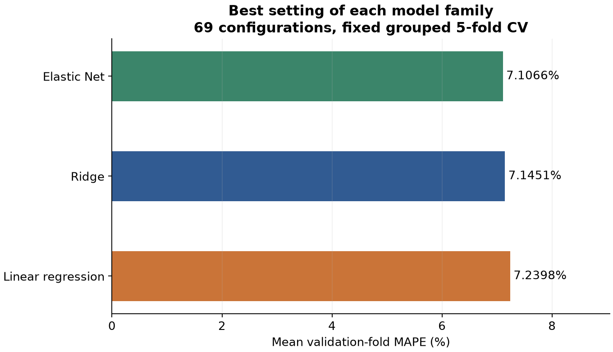
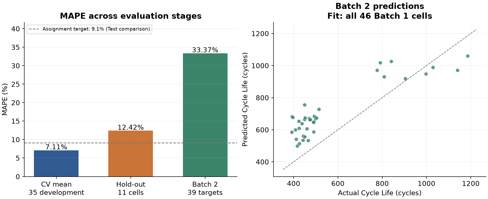
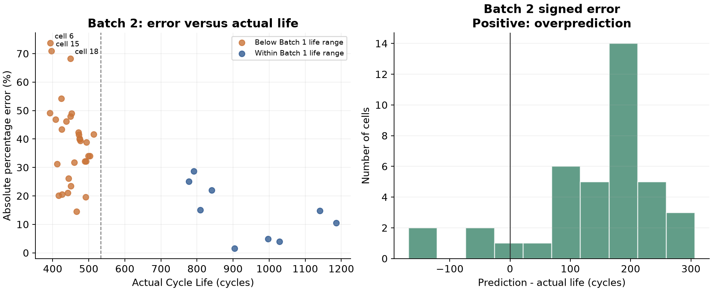

# ESS 배터리 수명 예측

배터리 **첫 100사이클의 신호로 최종 Cycle Life를 예측**하는 개인 수업 프로젝트다. Batch 1·2·3 EDA로 전략을 설계하고, Batch 1에서 개발한 회귀 모델을 Batch 2에서 평가했다. 딥러닝은 사용하지 않는다.

> **개발 버전 0.2.0 · 최종 실험 v02_submission · Day 2 제출 준비 완료.** 그룹 CV로 선택한 Elastic Net의 MAPE는 CV **7.11%**, Hold-out **12.42%**, Batch 2 **33.37%**다. 과제 Target 9.1%는 달성하지 못했으며 배치 간 일반화 한계를 분석했다. 갱신: 2026-10-05 (Asia/Seoul).

## 프로젝트 개요

| 항목 | 내용 |
| --- | --- |
| 데이터 | [Kaggle MIT-Stanford Battery Dataset](https://www.kaggle.com/datasets/itshpark/data-driven-prediction-of-battery-cycle), Severson et al. (2019) 관련 데이터 |
| 개발·학습 | Batch 1, 2017-05-12, 46셀 |
| 필수 최종 평가 | Batch 2, 2018-02-20, 47셀 예측·수명이 있는 39셀 평가 |
| 선택 추가 평가 | Batch 3, 2018-04-12, Day 1 EDA만 수행; Day 2 평가 생략 |
| 태스크·단위 | Regression, 셀당 한 행; 타깃은 원본 `cycle_life`(사이클) |
| 입력 | 첫 100사이클 이내의 `delta_q_log10var` 한 개 |
| 제출자 | 울산 3반 이웅희, 개인 과제 |
| Day 2 제출 | [Public GitHub 링크](https://github.com/LWH4Data/battery-project), 마감 DAY 2 16시 |

원본 139셀을 보존했다. 수명 결측 10셀을 임의로 대체하지 않았으며, 논문의 셀 제외·병합·분할 규칙을 과제에 자동 적용하지 않았다. Batch 2·3은 과제에 따라 Day 1 EDA에서 관찰했고, Day 2 모델 선택에는 Batch 1 개발 CV만 사용했다.

## 개발 버전과 기술 스택

| 구분 | 버전·기록 |
| --- | --- |
| 프로젝트 | **0.2.0**, [pyproject.toml](pyproject.toml); 메타데이터 버전이며 별도 GitHub 릴리스 발행은 아님 |
| 첫 기준 실험 | [v01_baseline](configs/experiments/v01_baseline.json), 2026-10-02 OLS 개발 CV; 소스·설정·분할·결과 보존 |
| 최종 제출 실험 | [v02_submission](configs/experiments/v02_submission.json), 2026-10-05 후보 비교·선택·Hold-out·Batch 2 평가 |
| 환경 | [uv.lock](uv.lock) 정확한 직접·간접 의존성, [환경 기록](configs/environment.json), [v02 실행 환경·해시](artifacts/experiments/v02_submission/run-manifest.json) |
| 데이터·분할 | [원본 스냅샷](configs/data-snapshot.json), [그룹 분할](artifacts/splits/batch1_group_holdout_cv.json), 입력 CSV SHA-256 |
| 선정 기록 | [selection-lock.json](artifacts/experiments/v02_submission/selection-lock.json), Hold-out·Test 예측 전에 설정 고정 |

실행 환경은 Python 3.12 계열, macOS Apple Silicon이다. 2026-10-02 환경 기록과 2026-10-05 v02 실행에서 아래 버전을 확인했다.

| 기술 | 버전 | 용도 |
| --- | --- | --- |
| Python / uv | 3.12.13 / 0.12.19 | 실행 환경·잠금 의존성 관리 |
| NumPy / pandas | 2.5.3 / 3.0.6 | 수치 계산·표 처리 |
| SciPy | 1.18.1 | 통계 분석·가설검정 |
| Matplotlib | 3.11.2 | EDA·평가·오차 시각화 |
| h5py / mat73 | 3.16.0 / 0.65 | HDF5·MATLAB 원본 읽기 |
| ipykernel | 7.4.0 | 프로젝트 노트북 커널 |
| scikit-learn | 1.9.1 | 회귀·그룹 CV·Pipeline·Grid Search·평가 |
| joblib | 1.6.0 | 로컬 학습 Pipeline 저장 |

`pyproject.toml`의 `>=`는 허용 범위이며 정확한 재현 버전은 `uv.lock`을 따른다. Optuna는 설치·사용하지 않았다. 코드는 Git으로 추적한다. 실행 당시 HEAD는 이전 커밋이며, 새 소스·설정의 해시는 run-manifest에 별도로 기록돼 있다.

## 파일 구조

```text
battery-project/
├── README.md / AGENTS.md
├── pyproject.toml / uv.lock / .python-version
├── .gitignore / .gitattributes
├── configs/
│   ├── environment.json / data-snapshot.json
│   └── experiments/{v01_baseline,v02_submission}.json
├── data/
│   ├── README.md
│   ├── raw/{batch1,batch2,batch3}/       # 원본 MAT, Git 제외
│   ├── interim/{batch1,batch2,batch3}/   # 필요한 중간 저장용
│   └── processed/                       # 향후 확정 입력 저장용
├── notebooks/
│   ├── 00_data_check.ipynb               # 원본·배치별 기술통계
│   ├── 01_day1_eda.ipynb                 # 5개 EDA·검정·전략
│   ├── 02_day2_modeling.ipynb            # 기존 v01 분할·기준 CV
│   └── 03_day2_final_model.ipynb         # 최종 비교·평가·오류 분석
├── src/
│   ├── data.py / eda_*.py                # 원본 준비·EDA
│   ├── modeling_baseline.py             # v01 보존
│   ├── modeling_submission.py           # v02 선택·평가·해시 검증
│   └── day2_final_figures.py             # 저장 결과 시각화
├── artifacts/
│   ├── splits/                          # 셀·프로토콜 배정
│   └── experiments/{v01_baseline,v02_submission}/
│       └── 지표·후보점수·예측·선정 lock·실행 manifest
├── outputs/
│   ├── project-output-guidelines.md     # 과제 기준·확정 사항
│   ├── day1/                            # EDA·피처 CSV·그림·PDF
│   └── day2/                            # 성능 CSV·오류 분석·그림·QA
└── work/                                # 임시 작업, Git 제외
```

빈 준비 폴더는 GitHub에서 보이지 않을 수 있다. `interim`은 원본 반복 읽기를 줄이는 중간 저장소이며 필수 처리 단계가 아니다. 현재 모델 입력은 [Day 1 피처 CSV](outputs/day1/early_feature_candidates.csv)에 있으며, 전체 상세값을 별도 파일로 저장하지 않았다. 원본 MAT·`.venv`·`work`·학습된 `*.joblib`는 공개 저장소에서 제외했다.

## 환경 설정과 실행

```bash
git clone https://github.com/LWH4Data/battery-project.git
cd battery-project
uv sync --locked
uv run python --version
```

노트북 편집기의 커널을 프로젝트 `.venv/bin/python`으로 선택한다. JupyterLab은 별도로 설치하지 않았다.

| 노트북 | 실행에 필요한 데이터 | 내용 |
| --- | --- | --- |
| [00_data_check](notebooks/00_data_check.ipynb) | 원본 MAT 3개 | 원본 구조·기술통계·곡선 확인 |
| [01_day1_eda](notebooks/01_day1_eda.ipynb) | 원본 MAT 3개 | EDA·검정·피처 생성; 재실행 시 Day 1 출력을 다시 저장 |
| [02_day2_modeling](notebooks/02_day2_modeling.ipynb) | 배포된 피처 CSV | 기존 v01 CV 재실행; v01 출력 덮어쓰기 |
| **[03_day2_final_model](notebooks/03_day2_final_model.ipynb)** | 배포된 CSV·JSON | **최종 결과 열람·성능표·그래프·오류 분석** |

제출 결과는 **03 노트북**부터 확인할 수 있다. 기존 `v02_submission/metrics.json`이 있으면 저장 결과를 읽으며 새 학습·Test 예측을 하지 않는다. 원본이 필요한 00·01은 [data/README.md](data/README.md)의 경로에 MAT를 넣는다. 01은 크기와 SHA-256으로 동일 원본을 검증하므로 파일 복사로 수정 시각이 바뀌어도 허용한다.

읽기 전용 실행 검증은 아래와 같다. 공개 저장소에서 제외한 두 모델 파일의 누락만 허용하며, 코드·설정·입력·분할·선정 lock·CSV/JSON 해시는 확인한다.

```bash
uv run python -c 'from pathlib import Path; from src.modeling_submission import verify_only; print(verify_only(Path.cwd(), require_models=False))'
```

같은 설정으로 모델을 다시 만들 필요가 있을 때만 아래 명령을 사용한다. 원본 결과를 검증한 뒤 **선정된 설정만** 별도 `reproductions/`에 재학습하며 후보 탐색을 반복하지 않는다. 재현된 Test는 새 독립 평가가 아니다.

```bash
uv run python -m src.modeling_submission --reproduce
```

일반 실행은 기존 v02 실험을 덮어쓰지 않는다. 입력 CSV를 변경하면 해시 검사가 중단되므로 검증을 건너뛰지 않는다. `.gitattributes`는 CSV의 원래 바이트를 보존한다. 현재 환경의 실행 및 원본 없이 공개 파일만 복사한 별도 경로에서 결과·해시를 읽는 과정을 검증했으며, 다른 OS에서의 학습 결과 일치까지 확인한 것은 아니다.

## EDA — 관찰에서 모델 전략으로

상세 근거는 [Day 1 원고](outputs/day1/day1-report.md)와 [실행 노트북](notebooks/01_day1_eda.ipynb)에 있다.

| 질문 | 핵심 관찰·해석 | 모델 전략에 미친 영향 |
| --- | --- | --- |
| Cycle Life 분포 | Batch 1/2/3 중앙값 **858.5 / 472.0 / 1,005.5**. Batch 2 단수명(<500) 28/39, Batch 3 장수명(>1,000) 23/44. Batch 1에 단수명 셀 없음. [그래프](outputs/day1/figures/q1_life_distribution.png) | 단수명 셀을 제거하지 않고 배치 간 분포 차이와 상대 오차를 평가 |
| Qd 열화·Knee | 후기 기울기가 초기보다 더 음수인 셀 46/46, 45/47, 46/46. 탐색적 Knee 중앙값 약 600/351/831사이클. 물리적 Knee 확정은 아님. [그래프](outputs/day1/figures/q2_report_degradation.png) | 전체 곡선·말기 기울기·Knee는 EDA에만 사용, 미래 정보 피처 차단 |
| ΔQ(V) | 139셀의 cycle 10·100 곡선·동일 1,000점 전압 축 확인. 장단수명 집단에서 초기 변화 신호 차이 관찰. [곡선](outputs/day1/figures/q3_delta_q_curves.png) | 곡선 분산을 셀 단위 초기 피처로 요약, 불필요한 보간 없음 |
| C-rate·수명 | C1–수명 Spearman은 −0.483 / +0.055 / −0.229. 단일 충전 속도로 배치 공통 관계를 설명하기 어려움. [그래프](outputs/day1/figures/q4_c1_life_relationship.png) | 프로토콜을 인과적 원인으로 단정하지 않고 분할 그룹으로 사용 |
| 상관·공선성 | ΔQ log분산–수명 Pearson −0.886 / −0.902 / −0.702. Batch 1 ΔQ 최소·평균 상관 0.9925, Qd100=Qd10+ΔQd 같은 중복 정의 존재. [상관](outputs/day1/figures/q5_report_correlations.png) · [중복](outputs/day1/figures/q5_report_redundancy.png) | 대표 피처 하나로 단순 회귀·규제 회귀 비교; 확장 피처는 이번 제출에 미채택 |

**질문 3 가설검정:** Batch 2 장수명(>1,000) 3셀과 단수명(<500) 28셀의 `log10(ΔQ 분산)` 평균이 같다는 귀무가설을 양측 Welch t-test, α=0.05로 검정했다. 평균 차이(long−short)는 **−0.9315**, 95% Welch 구간 **[−1.1712, −0.6918]**, **p=0.001378**이었다. 정확 순열 보완은 4,495개 집단 배정을 열거한 양측 두 꼬리 방식으로 **p=0.0004449**였다. [검정 그래프](outputs/day1/figures/q3_test_result.png)

작은 장수명 표본·프로토콜 교란·EDA 후 선택된 비교라는 한계가 있어 탐색적 근거로 해석한다. 초기 신호의 연관성을 지지하지만 인과관계나 독립 확증을 뜻하지 않는다. Batch 2에서 관찰한 검정 결과를 Day 2 튜닝 점수로 쓰지 않았다.

## Modeling

### 피처와 타깃

```text
ΔQ(V) = Qdlin(cycle 100, V) − Qdlin(cycle 10, V)
x = delta_q_log10var = log10(var(ΔQ(V), ddof=0))
y = 원본 cycle_life (사이클)
```

공통 전압 축의 분산(Ah² 수치)을 log10으로 바꾼다. 임의 epsilon·타깃 로그 변환·결측 대체·셀 제외·예측 clipping은 적용하지 않았다. 강한 초기 연관성과 중복 피처를 근거로 **한 개 입력을 유지**했다. 현재 입력이 하나이므로 모델 내부 다중공선성은 없으며, Elastic Net을 공선성 제거 성공 사례로 해석하지 않는다. 추가 IR·온도·충전시간·프로토콜 피처는 향후 후보로 남겼다.

### 분할·누수 방지·재학습

| 구분 | 셀 / 프로토콜 그룹 | 역할 |
| --- | --- | --- |
| Batch 1 개발 | 35 / 18 | 저장된 그룹 5-fold CV로 후보 선택, 선택 모델 학습 |
| Batch 1 Hold-out | 11 / 5 | 개발 35셀에 학습한 선택 모델의 별도 검증 |
| Batch 1 전체 | 46 / 23 | 설정 고정 후 Batch 2용 최종 모델 재학습 |
| Batch 2 | 원본 47, 평가 39 | 최종 모델로 한 번 예측; 미상 타깃 8셀 보존 |

동일 `policy_readable`의 셀을 묶어 그룹의 약 20%를 `GroupShuffleSplit` Hold-out으로 보관했다. 개발 부분의 `GroupKFold(5, shuffle=True)`도 그룹을 분리한다. seed=**42**, 실제 Hold-out은 11/46셀이다. CV validation 셀 수는 7·8·8·6·6이며 각 개발 셀은 한 번의 OOF 예측을 갖는다.

분할 뒤 `StandardScaler → regressor` Pipeline을 적용해 **각 fold train에서만 전처리를 fit**한다. 동일 셀·프로토콜의 train/valid 중복을 검사했고 Hold-out·Test는 선택 점수에 포함하지 않았다. 셀당 한 행의 초기 관측 피처이므로 사이클을 무작위로 나누는 시계열 분할을 하지 않는다. 표준화는 배치 분포 차이를 해소하지 않는다. [그룹 CV 공식 문서](https://scikit-learn.org/stable/modules/cross_validation.html)

### 모델 선택 및 최적화 방법·이유

강한 ΔQ 신호와 작은 개발 표본에 맞춰 해석 가능한 선형식부터 비교했다. LinearRegression은 규제 없는 기준선, Ridge는 L2 계수 축소, Elastic Net은 L1·L2를 함께 적용해 단일 계수의 변동을 완화하는 비교 후보다. 규제 회귀의 학습 목적도 오차 제곱합에 규제를 더한 것으로 **MAPE 직접 최소화 학습은 아니다**. [OLS](https://scikit-learn.org/stable/modules/generated/sklearn.linear_model.LinearRegression.html) · [Ridge](https://scikit-learn.org/stable/modules/generated/sklearn.linear_model.Ridge.html) · [Elastic Net](https://scikit-learn.org/stable/modules/generated/sklearn.linear_model.ElasticNet.html)

**GridSearchCV**로 지정한 작은 후보 공간을 모두 비교했다. 탐색 결과와 선택 근거를 추적하기 쉽고, 같은 저장 fold에서 공정하게 비교할 수 있어서 선택했다. `alpha=np.logspace(-4, 4, 17)`, Elastic Net `l1_ratio=[0.1, 0.5, 0.9]`로 **69설정 × 5fold = 345개 후보 학습**을 실행했다. Optuna는 사용하지 않았다. 지정된 이산 후보 안의 최저값이며 연속 공간의 전역 최적값을 보장하지 않는다. [GridSearchCV 공식 문서](https://scikit-learn.org/stable/modules/generated/sklearn.model_selection.GridSearchCV.html)

| 후보 | 설정 수 | 해당 모델의 최저 CV 설정 | 평균 MAPE (%) |
| --- | --- | --- | --- |
| LinearRegression | 1 | 튜닝 없음 | 7.2398 |
| Ridge | 17 | alpha=1 | 7.1451 |
| ElasticNet | 51 | alpha=0.1, l1_ratio=0.5 | 7.1066 |

**최종 모델은 Elastic Net(alpha=0.1, l1_ratio=0.5)**이다. 개발 그룹 CV의 validation MAPE 산술평균이 가장 낮아 선정했다. OLS 대비 개선은 **0.1332%p**로 작으며 통계적 우월성의 증거로 해석하지 않는다. 후보 비교에 사용한 CV이므로 선택 후 성능에 낙관성이 남을 수 있어 별도 Hold-out을 보고했다.

Ridge는 SVD solver, Elastic Net은 deterministic cyclic 좌표하강법(`max_iter=100000`, `tol=1e-8`, `random_state=42`)을 고정했다. 수렴 경고가 발생하면 중단하도록 했으며 이번 실행에는 수렴 경고가 없었다. 정확한 동점일 때만 고정 후보 순서를 사용했다. [전체 69후보 점수](artifacts/experiments/v02_submission/candidate_scores.csv)



설정을 잠근 뒤 개발 35셀 모델로 Hold-out 11셀을 평가하고, **동일 설정을 Batch 1 전체 46셀에 재학습**해 Batch 2를 한 번 예측했다. Test 결과로 피처·규제·모델을 다시 조정하지 않았다. 최종 입력 단위로 환산한 식은 아래와 같다.

```text
Cycle Life 예측 = -770.8754 − 411.7807 × delta_q_log10var
```

### 평가 지표와 이유

| 지표 | 정의 | 선택 이유·한계 |
| --- | --- | --- |
| **MAPE (%)** | `100 × mean(abs(예측−실제) / 실제)` | 과제 주 지표·논문 Target 비교. 같은 절대오차를 단수명 셀에서 더 크게 평가하고 0 근처 타깃에는 불안정 |
| MAE (사이클) | `mean(abs(예측−실제))` | 수명 단위의 평균 오차를 직접 설명 |
| RMSE (사이클) | `sqrt(mean((예측−실제)²))` | 큰 예측 오차에 더 민감하게 반응 |

평가 타깃은 모두 양수다. scikit-learn MAPE 반환값에 100을 곱해 %로 기록했다. 예측값을 그대로 사용했으며 비양수 예측은 없었다. [MAPE](https://scikit-learn.org/stable/modules/generated/sklearn.metrics.mean_absolute_percentage_error.html) · [MAE](https://scikit-learn.org/stable/modules/generated/sklearn.metrics.mean_absolute_error.html) · [RMSE](https://scikit-learn.org/stable/modules/generated/sklearn.metrics.root_mean_squared_error.html)

## 성능 결과 — 과제 Reporting Format

`Train (Batch 1 CV)`는 훈련 표본 적합 오차가 아니라 **5개 validation fold MAPE의 산술평균**이다. 아래는 선택 모델의 실제 결과다.

| 구분 | MAPE (%) | 비고 |
| --- | --- | --- |
| Train (Batch 1 CV) | **7.1066** | 개발 35셀, 그룹 5-fold, 후보 선택에 사용 |
| Valid (Batch 1 Hold-out) | **12.4160** | 개발 35셀 학습 → 별도 11셀 |
| Test (Batch 2) | **33.3704** | Batch 1 전체 46셀 학습 → 39/47셀 평가 |
| Gap (Train-Valid) | **+5.3095%p** | Valid−CV; 검증 오차 증가 |
| Gap (Valid-Test) | **+20.9544%p** | Test−Valid; 배치와 학습 범위 차이 포함 |
| Gap (Target-Test) | **+24.2704%p** | **Batch 2 Test−9.1**, 과제 Target 미달성 |

Gap은 백분율의 차이이므로 **%p**로 표기했다. 양수는 오차 증가를 뜻하며 과적합·배치 변화의 단독 증명은 아니다. Hold-out 모델은 35셀, Test 모델은 46셀에 학습했으므로 `Gap (Valid-Test)`를 순수한 배치 효과로만 해석할 수 없다.

| 구분 | MAE (사이클) | RMSE (사이클) |
| --- | --- | --- |
| Train CV fold 평균 | 59.21 | 72.24 |
| Valid | 115.08 | 138.19 |
| Test Batch 2 | 163.89 | 176.64 |

Fold 간 MAPE 표본 SD는 **2.6575%p**이며 신뢰구간이 아니다. 35셀 OOF를 합친 보조 MAPE는 **7.0671%**로 셀 수가 다른 fold의 산술평균과 구분한다. [성능 CSV](outputs/day2/model_performance.csv) · [원본 지표](artifacts/experiments/v02_submission/metrics.json) · [fold별 지표](artifacts/experiments/v02_submission/cv_metrics.csv)



왼쪽은 개발→별도 검증→배치 평가에서의 오차 증가, 오른쪽은 Batch 2 단수명 셀의 과대예측을 보여준다. 점선 9.1%는 **Test 비교 Target**이며 CV로 논문 성능을 달성했다고 주장하지 않는다. 논문은 처리된 셀의 병합·제외·분할을 사용했고, 저자 코드의 두 번째 배치 파일 날짜도 2017-06-30으로 현재 과제의 2018-02-20과 다르다. **동일 조건의 논문 재현이 아닌 과제 기준 비교**다. [저자 공식 코드](https://github.com/rdbraatz/data-driven-prediction-of-battery-cycle-life-before-capacity-degradation)

Batch 2 수명 미상 **8셀(22, 23, 35, 36, 37, 38, 39, 40)**은 예측을 보존하고 오차·지표 계산에서만 제외했다. 성능은 수명이 관측된 39셀에 한정되며 전체 47셀의 검증된 성능으로 일반화하지 않는다. [47셀 전체 예측](artifacts/experiments/v02_submission/batch2_predictions.csv) · [Hold-out 예측](artifacts/experiments/v02_submission/holdout_predictions.csv)

## 오류 분석 — Batch 2 최종 예측

APE가 가장 큰 5셀이다. 셀 ID는 원본의 0부터 시작하는 인덱스이며 signed error가 양수면 과대예측이다.

| 셀 ID | 프로토콜 | 실제 수명 | 예측 수명 | APE (%) | 예측−실제 (사이클) |
| --- | --- | --- | --- | --- | --- |
| 6 | 3.6C(9%)-5C | 393 | 682.73 | 73.72 | +289.73 |
| 15 | 3.6C(9%)-5C | 396 | 677.05 | 70.97 | +281.05 |
| 18 | 5.2C(50%)-4.25C | 449 | 755.72 | 68.31 | +306.72 |
| 2 | 5.2C(50%)-4.25C | 424 | 653.99 | 54.24 | +229.99 |
| 19 | 6C(60%)-3C | 392 | 584.69 | 49.16 | +192.69 |

상위 5셀은 모두 **단수명(<500)·과대예측**이다. 셀 6·15는 같은 `3.6C(9%)-5C` 프로토콜이며 입력 값은 Batch 1 피처 범위 안에 있어 단순한 입력 범위 밖 외삽만으로 설명되지 않는다. 수명 미상 셀이나 큰 오차 셀을 임의로 제외하지 않았다.

| Batch 2 평가 셀 구간 | 셀 수 | MAPE (%) | 평균 signed error (사이클) |
| --- | --- | --- | --- |
| Batch 1 수명 최솟값 534 미만 | 30 | 39.16 | +175.53 |
| Batch 1 수명 범위 534~1,227 이내 | 9 | 14.06 | +40.00 |

전체 **35/39셀**을 과대예측했고 평균 signed error는 **+144.26사이클**이다. 534 미만 30셀은 모두 과대예측됐다. 평가 셀의 입력 log분산은 11/39셀이 Batch 1 범위를 벗어났지만, 큰 오차는 범위 안에서도 발생했다. 구간별 비교는 Test 후의 기술적 오류 분석이며 인과검정·재튜닝 기준이 아니다.



**원인 가설:** Batch 1에 단수명 학습 표본이 없고, 배치별 피처–수명 관계의 기울기·절편이나 프로토콜별 차이를 단일 선형식이 충분히 설명하지 못했을 수 있다. 강한 상관은 순위·연관성을 보여주지만 예측 보정이 배치 사이에 그대로 유지됨을 보장하지 않는다. MAPE 분모가 작은 단수명 구간에서는 절대오차가 상대적으로 더 커진다. 센서 오류·불량 셀의 확정 판정은 하지 않는다.

**향후 개선:** 대표성 있는 단수명 학습 데이터를 확보하고, 초기 Qd·IR·온도·충전 조건 피처의 기여를 개발 데이터 안에서 비교한다. 배치별 관계·측정 조건·곡선 정렬을 점검하고 별도의 새 외부 데이터로 개선을 확인한다. 이번 Test를 보고 조정한 모델을 같은 Test의 독립 성능으로 다시 보고하지 않는다. [전체 셀 오류 CSV](outputs/day2/batch2_error_analysis.csv) · [프로토콜·구간별 분석](outputs/day2/batch2-error-summary.json)

기존 [v01 OOF 오류](outputs/day2/oof_error_analysis.csv)는 기준 실험의 개발 오류 기록이며 위 최종 Test 분석과 구분한다.

## ESS 도메인 해석

초기 수명 추정은 셀 선별, 수명 편차 점검 우선순위, 교체·유지보수 계획의 참고 정보가 될 수 있다. 그러나 현재 Batch 2에서는 534사이클 미만 30셀에서 평균 175.53사이클 과대예측해 교체 시점을 늦게 판단할 위험이 있다. 이 결과만으로 실제 BESS 교체·안전 결정을 자동화하기에는 검증이 부족하다.

예측 대상은 실험 셀의 **총 Cycle Life**다. 잔여 수명(RUL)·달력 수명·안전 위험을 직접 예측하지 않는다. 실제 적용에는 온도·SOC·충방전 프로파일과 셀/모듈 구성 차이를 반영한 현장 외부 평가, 불확실성·실패 비용 평가가 필요하다. 운영 단계에서는 입력 분포 변화(Data Drift)와 관측 수명 대비 예측 성능(Model Drift)을 추적하고 재학습 조건을 별도로 설계해야 한다. 현장 Live Test·운영 모니터링은 이번 과제에서 구현하지 않았다.

## Day 2 제출 준비 상태

- [x] 목적·데이터·개발/실험 버전·기술 스택·실행 방법
- [x] EDA 핵심 발견·그래프 해석·모델 전략 연결
- [x] 최종 피처·타깃·분할·누수 방지·재학습 범위 확정
- [x] 후보 69설정 비교·최종 모델·선정 근거
- [x] 최적화 방법과 선택 이유·평가지표와 한계
- [x] Hold-out·Batch 2 최종 평가·과제 성능표·Target Gap
- [x] Batch 2 실제 오류 분석·원인 가설·개선 방향
- [x] ESS 활용 가능성·운영 한계
- [x] 실행 노트북·해시/지표 검산·환경 잠금 검증
- [x] Public GitHub 저장소와 제출용 README 준비

**제출 링크: https://github.com/LWH4Data/battery-project** — 과제 제출처에 이 링크를 직접 제출한다. 링크 제출 자체는 사용자의 작업이다. Batch 3 성능은 선택 과제로 생략했다. 기존 Day 2 PDF는 v01 진행 기록이며 **최신 결과는 이 README와 v02**를 따른다. Day 1 PDF는 Day 1 산출물로 보존했다.

상세 작업 기준은 [과제 가이드](outputs/project-output-guidelines.md), AI 작업 규칙은 [AGENTS.md](AGENTS.md)에 있다. 샘플의 `requirements.txt`·2인 역할·파일명은 예시이며 현재 개인 과제의 uv 환경과 실제 구조를 사용한다.

## 참고문헌

- [Severson et al. (2019). Data-driven prediction of battery cycle life before capacity degradation. *Nature Energy*, 4, 383–391.](https://www.nature.com/articles/s41560-019-0356-8)
- [논문 저자 공식 코드·데이터 처리](https://github.com/rdbraatz/data-driven-prediction-of-battery-cycle-life-before-capacity-degradation)
- [과제 데이터 출처: Kaggle](https://www.kaggle.com/datasets/itshpark/data-driven-prediction-of-battery-cycle)
- scikit-learn 공식 문서: 본문 모델·Grid Search·CV·평가 지표 링크

## 참여자

**이웅희 (울산 3반)** — EDA, 가설검정, 피처 엔지니어링, 모델 설계·개발, 성능 평가와 문서화를 수행한 개인 과제.
